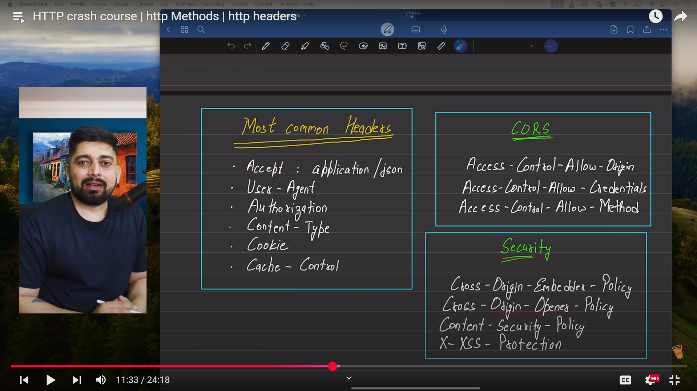

# 🧠 Backend Development Course - Node.js & Express

This repository contains my learning journey of backend development using Node.js, Express.js, Docker, and AWS.

 

Key focus areas include:
- Deep understanding of core JavaScript concepts used in backend development  
- Building scalable applications using Node.js and Express.js  
- Implementing authentication systems using Sessions and JWT  
- Designing RESTful APIs with proper routing, controllers, and middleware  
- Using Docker to containerize backend applications  
- Deploying backend services using AWS ECR for production-ready workflows  
- Testing and debugging APIs using Postman  

This repo includes code snippets, notes, and project implementations covered during the course.

## HTTP crash course 

[Click here](https://www.youtube.com/watch?v=qgZiUvV41TI&list=PLu71SKxNbfoBGh_8p_NS-ZAh6v7HhYqHW&index=12&t=763s)

### http headers 
  
  

### http Methods

  

### http Status code 
  